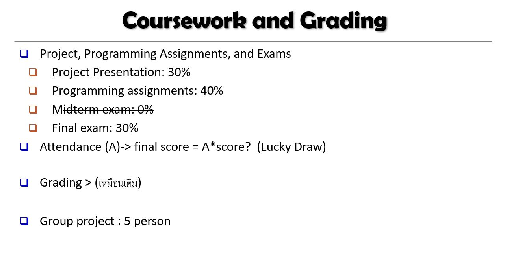

# DWDM21
Data Warehouse &amp; Data Mining 2021

นางสาวภัทรสร เทพบุตร 623020531-5

กลุ่ม เทเลทับบี้
1. นางสาวภัทรสร เทพบุตร
2. นางสาวสุพิชญา ตั้งกิจวานิชย์
3. นางสาวสุภาวดี คำทุย
4. นางสาวอุมาพร คำภิชัย
5. นางสาวพลอยบงกช แสงโทโพธิ์

* สารบัญเนื้อหา

* บทที่1 [Introduction](https://github.com/PhattarasornTeppabut/DWDM21/blob/main/Chapter%201.pdf)
  * What is Data Mining
  * Knowledge Discovery (KDD) Process

* บทที่2 [Getting to kmow your data](https://github.com/PhattarasornTeppabut/DWDM21/blob/main/DWDM_Chapter2..pdf)
  * Types of Data Set:(1) Record Data
  * Types of Data Set:(2) Graphs and Networks
  * Types of Data Set:(3) Orderd Data
  * Types of Data Set:(4) Spatial, image and multimedia Data
  * Data Objects
  * Attributes
  
* บทที่3 [Data Preprocessing](https://github.com/PhattarasornTeppabut/DWDM21/blob/main/Chapter-3.pdf)
  * Data Preprocessing: An Overview
  * Major Tasks in Data Preprocessing
  * Data Quality: Why preprocess the Data
  * Data Quality
  * Data Cleaning
  * Incomplete (Missing) Data
  * How to HAdle Missing Data

* บทที่4 [OLAP](https://github.com/PhattarasornTeppabut/DWDM21/blob/main/Chapter-4.pdf)
  * What is a Data Warehouse
  * Data Warehouse-Subject-Oriented
  * Data Warehouse-Nonvolatile
  * Data Warehouse:A Multi-Tiered Architecture
  * Data Cubes
  * Data Warehouse: ประเภทของ Data Warehouse
  * Data Warehouse: OLTP
  * Data Warehouse: ETL
  * Data Warehouse: Star VS Snowflake Schema
  * Data Warehouse: Data Lake
  * Data Warehouse: การประมวลผล

* บทที่6 [Mining Frequent Patterns,Association](https://github.com/PhattarasornTeppabut/DWDM21/blob/main/Chapter-6.pdf)
  * What is Pattern Discovery
  * Pattern Discovery: Why Is It Important
  * Basic Concepts: K-Itemsets and Their Supports
  * Basic Concepts: Frequent Itemsets(Patterns)
  * Form Frequent Itemsets to Association Rules
  * Mining Frequent Itemsets to Association Rules
  * Efficient Pattern Mining Methods
  * Apriori Pruing and Scalable Mining Methods
  * Apriori: A Candidate Generation & Test Approach
  * The Apriori Algorithm- An Example

บทที่8 [Classification: Basic Concepts](https://github.com/PhattarasornTeppabut/DWDM21/blob/main/Chapter-8.pdf)
  * Supervised VS. Unspervised Learning(1)
  * Supervised VS. Unspervised Learning(2)
  * Prediction Problems: Classification vs. Numeric Prediction
  * Classification-Model COnsturtion. Validation and Testing
  * Decision Tree Induction: An Example
  * Information Gain: An Attribute Selection Measure
  * Example Attribute Selection with Information Gain
  * Bayes' Theorem: Basics
  * Naive Bayes Classifier: Training Dataset
  * Naive Bayes Classifier: An Example
  * Model Evaluation and Selection
  * [การบ้านคำนวณมือ](https://github.com/PhattarasornTeppabut/DWDM21/blob/main/623020531-5.pdf)
  
บทที่9 [Classification: Advanced Methods](https://github.com/PhattarasornTeppabut/DWDM21/blob/main/Chapter-9.pdf)
  * Neural Network for Classification
  * Discussion on the K-NN Algorithm
  * Algorithm: perceptron-Learning-Rule (จากหนังสือปัญญาประดิษฐ์ บุญเสริมAI)
  * ตัวอย่างการเรียนฟังก์ชัน AND และ XOR ด้วยกฎเรียนรู้เพอร์เซปตรอน

บทที่10 [Cluter Analysis: Basic Concepts and Methods](https://github.com/PhattarasornTeppabut/DWDM21/blob/main/Chapter-10.pdf)
  * What Is Cluter Analysis
  * What Is Good Clutering
  * The K-Means Clutering Methods
  * Example: K-Means Clutering
  * Discussion on the K-Means Methods
  * VAriations of K-Means
  
 
 
 * สารบัญ Github
 
 * บทที่2 [Data101](https://github.com/PhattarasornTeppabut/DWDM21/blob/main/Data101(Chapter2).ipynb)
   * Basic phython
    * Casting int() float() str()
    * Data Structure
      * วิธีสร้าง list ว่าง
      * List slicing
    * list+list
    * Loop ทำซ้ำๆ ขั้นตอนเหมือนๆกัน หลายๆรอบ
  * Nested loop
    * Condition เงื่อนไข (if ststement)
    * HW3 ตัดเกรด
    * Function
      * ลักษณะของ input(parameter)
    * HW4
* [Data102](https://github.com/PhattarasornTeppabut/DWDM21/blob/main/Data102(Chapter2).ipynb)
  * .head() .tail()
  * Boxplot
  * Time Series Plot
* [Data Visualization](https://github.com/PhattarasornTeppabut/DWDM21/blob/main/Data_Visualization.ipynb)
  * Visualization
    * Scatter plot
    * Plot
    * Bar chart
      * Grouped Barchart
      * Stacked Barchart เปรียบเทียบกรุ๊ปใหญ่ กับกรุ๊ปย่อยๆ
    * Histogram ดูความถี่ของข้อมูล
* [Distance Numpy](https://github.com/PhattarasornTeppabut/DWDM21/blob/main/Distance_Numpy.ipynb)
  * Numpy Array
    * สร้าง numpy array
    * matrix transpose
    * สร้าง matrix เริ่มต้น (zeros,ones)
    * สร้าง matrix random ค่าเเบบมั่วๆ
    * Indexing & Slicing ชี้ตัวค่าในเมทริกซ์ยังไง
    * Useful functions
  * Distance Matrix
    * Euclidean Distance (L2-norm)
    * Distance function
    * Manhattan Distance (L1-norm)
    * Quiz6
    * HW11
  
* MiniExam
    * [MiniExam](https://github.com/PhattarasornTeppabut/DWDM21/blob/main/MiniExam.ipynb)

* Project Midterm + Final 
  * [Project](https://github.com/PhattarasornTeppabut/DWDM21/blob/main/New_Project.ipynb)
  * [งานนำเสนอ Project](https://github.com/PhattarasornTeppabut/DWDM21/blob/main/Project%20%E0%B9%80%E0%B8%97%E0%B9%80%E0%B8%A5%E0%B8%97%E0%B8%B1%E0%B8%9A%E0%B8%9A%E0%B8%B5%E0%B9%89.pdf)
